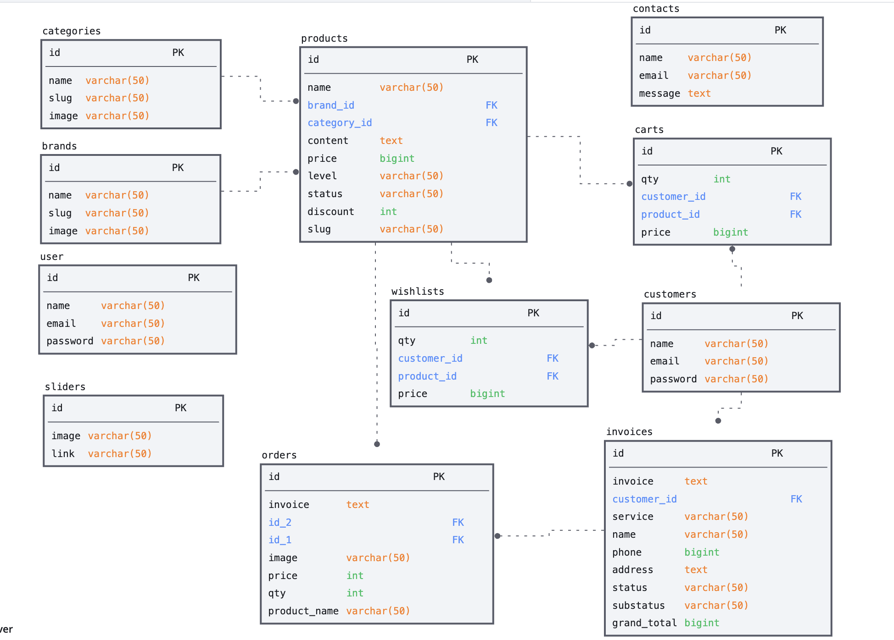

# e-commerce

<p align="center"></p>

# How to clone project

How to clone project git repository help to follow this command

```sh
git clone https://github.com/nheanvitou02/e-commerce.git`
```

# How to run project

This repository project There are 2 project server and client

## Run server or backend project

<p align="center"><a href="https://laravel.com" target="_blank"></a></p>

### Software required run project

- **[Composer](https://getcomposer.org/download/)**
- **[PHP](https://www.php.net/downloads.php/)**
- **[XAMPP](https://www.apachefriends.org/)**

### command and step to run

How to run backend project plz help to follow this step

## Open folder project on VScode


- **[Install Vscode](https://code.visualstudio.com/download/)**

## Run to folder server_admin

```sh
cd server_admin
```

Create file `.env` and content copy from file `.env.example`

## Run to install dependencies of project

```sh
composer install
```

## Run migratetion to create table in databass

```sh
php artisan migrate
```

<br />
After run migrate plz make sure aleady create databass in `mysql phpmyadmin` name databass like value env

## Runs the app in the development mode.
```sh
php artisan serve
```
## Open [open app](http://127.0.0.1:8000/) to view it in your browser.

## Run seed to create user login

```sh
php artisan db:seed --class=UserSeeder
```
```sh
admin@gmail.com
```
```sh
password
```

## Project structure and pattern

In the project we are using `MVC` pattern

<p><a href="https://www.tutorialspoint.com/design_pattern/mvc_pattern.htm" target="_blank"></a></p>

## Run client project

<p align="center"><a href="https://vuejs.org/guide/introduction.html" target="_blank"></a></p>

## Software required run project

- **[Node js](https://nodejs.org/en/)**

## command and step to run

How to run client project plz help to follow this step

## Open folder project on VScode

- **[Install VScode](https://code.visualstudio.com/download/)**

## Run to folder client

```sh
cd client
```

## Project Setup

```sh
npm install
```

### Compile and Hot-Reload for Development

```sh
npm run dev
```

## Relational database diagram

<p></p>
